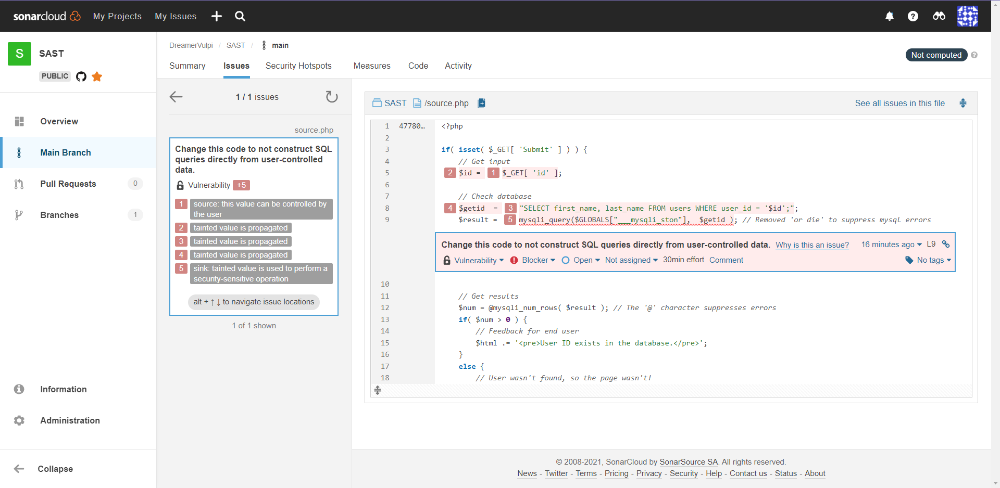
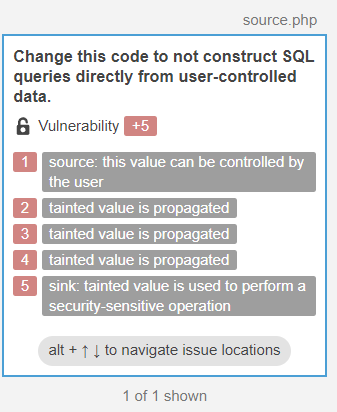
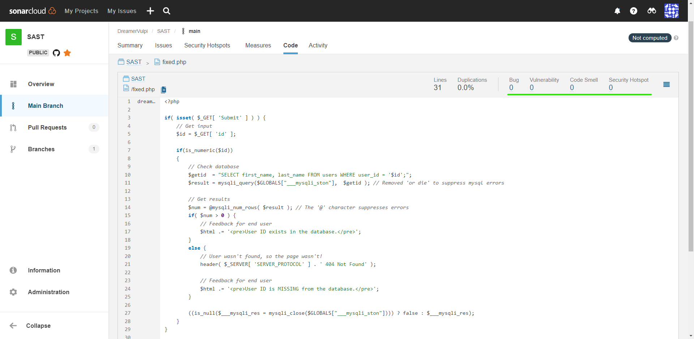

# SAST

## 1 Пункт

Необходимо найти участок кода, содержащий инъекцию SQL кода в задании Blind Sql Injection на сайте dvwa.local с использованием статического анализатора кода. Проанализировать код и сделать кодревью, указав слабые места.

Использовался статический анализатор https://sonarcloud.io/

Как видим, статический анализатор нашёл 5 проблем.

1. > $_GET[ 'id' ];
   
   Значение 'id' пользователь может изменить не только на id, но и на любую из возможных SQL команд и успешно отправить. Это связано с отсутствуем какой-либо обработки вводимых данных от пользователя перед добавлением в запрос.

2. > $id = 
3. > "SELECT first_name, last_name FROM users WHERE user_id = '$id';";
4. > $getid  = 
5. > mysqli_query($GLOBALS["___mysqli_ston"],  $getid ); 
   
   Соответствено данная уязвимость распространяется на дальнейшие действия программы.

## 2 Пункт

Разработать свою систему вывода информации об объекте на любом языке, исключающий возможность инъекции SQL кода. Возможно исправление участка кода из dvwa.local

В моём случае я исправлю участок кода из dvwa.local

Так как нет обработки id, то собственно, его и реализовываю чтобы закрыть уязвимость. Самый простой вариант для обработки является проверка на число. В php присутствует необходимая функция:

> if(is_numeric($id)) 

При помощи if происходит проверка, если функция is_numeric() возвращает True, то значит введённое значение состоит только из цифр, иначе код ниже не будет выполнен.

Исправленный код был проверен статическим анализатором и уязвимостей не нашёл.

